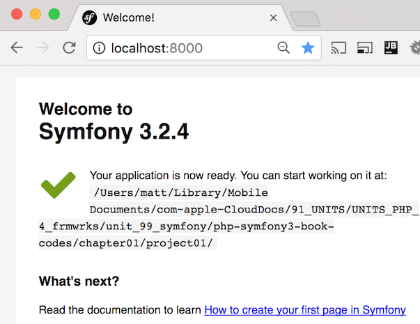
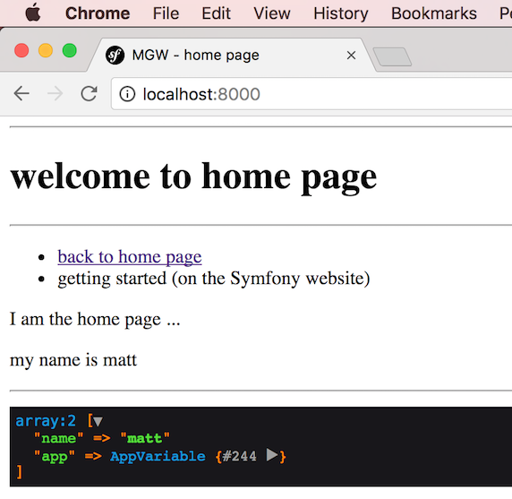
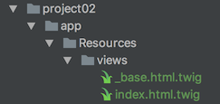
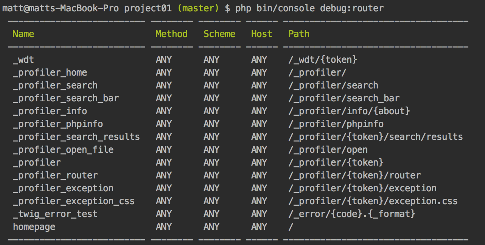

\mainmatter

# First steps

## It isn't working

If you don't get the default Sfymfony home page, try this:

- copy the contents of `/web/app_dev.php` into `/web/app.php`

WARNING - this is just for now (we'll learn property Symfony configuration later). But this should get you going for now. You should NEVER do this for a project that might actually end up as a public production site!


## All I get is the symfony home page (`project01`)

Figure \ref{page0}  is your basic, default Symfony home page if everything is up and running for a new Symfony project.



## What we'll make (`project02`)

See Figure \ref{page1} for a screenshot of the new homepage we'll create this chapter.



There are 3 things Symfony needs to serve up a page (with the Twig templating system):

1. a route
2. a controller class and method
3. a Twig template

The first 2 can be combined, through the use of 'Annotation' comments, which declare the route in a comment immediately before the controller method defining the 'action' for that route, e.g.:

```php
    /**
     * @Route("/students/list")
     */
    public function listAction(Request $request)
    {
        $studentRepository = new StudentRepository();
        $students = $studentRepository->getAll();

        $argsArray = [
            'students' => $students
        ];

        $templateName = 'students/list';
        return $this->render($templateName . '.html.twig', $argsArray);
    }
```

The last (Twig template) can be a single file, and a simpler template that 'extends' a base template (which has all the standard doctype, css, js and core HTML structure in it).

If don't know much about Twig then go off and learn it (you can learn it stand alone, with a simple micro-framework like Silex, and as part of learning Symfony).


## First - get rid of all that default page stuff

We'll stick with the single `AppBundle` that we get provided with a new Symfony project (most logic goes into a 'bundle', we only need one for now).

A new Symfony project places its `DefaultController` at this location:

```
        /src/AppBundle/Controller/DefaultController.php
```

Figure \ref{controllers_dir} shows the `DefaultController.php` in this location.


Let's clear out the content of the controller, so there is no code in the body of the `indexAction()` method:

```php
    class DefaultController extends Controller
    {
        /**
         * @Route("/", name="homepage")
         */
        public function indexAction(Request $request)
        {
        }
    }
```

NOTES:
- leave all the 'uses' statements and the namespace, since they mean any classes we refer to, or annotations we use, all work correctly
- leave teh `Route` annotation comment there, since what we are about to write will be what we want to happend for a request for the website home page (i.e. the web root URL of `/` for our webapp)
- alse leave the `name="homepage"` part of the annotation route comment, since naming routes is very handy since it makes getting Twig to create links very easy

We want to use the template `index.html.twig`, since they all end in `.html.twig` let's concatenate that on later

```php
    $templateName = 'index';
```

Twig templates expect to be given an associative array of any special data for the template, so let's illustrate this by passing a parameter `name` with your name (I'm Matt, so that will be my name parameter's value!):

```php
    $argsArray =  [
        'name' => 'matt'
    ];
```

There is nothing magic about the array identifier `$argsArray` - it's just a habit I've got into when teaching Twig to my students - so change this (and anything - it's **your** project) to become more confident with working with the different bits of Symfony.

Symfomy's `Controller` class offers a handy method `render()` with accesses the Twig service in the Symfony application, so we can just invoke this method passing the template name (and appending the `.html.twig` string), and the array of arguments:

```php
    /**
     * @Route("/", name="homepage")
     */
    public function indexAction(Request $request)
    {
        $argsArray =  [
            'name' => 'matt'
        ];

        $templateName = 'index';
        return $this->render($templateName . '.html.twig', $argsArray);
    }
```

Note that this final statement is a `return` statement. Basically any web application received (and interprets the contents of) an HTTP 'request', and builds and sends back an HTTP 'response'. The way Symfony (and most MVC webapps) work is that the controller method invoked for a given route has the responsibility of building and returning a 'response' (or sometimes just the text 'content' of a response, and the MVC application will build an HTTP response around that text content).

## Our 2 Twig templates (`_base.html.twig` and `index.html.twig`)

Twig templates are located in this directory:

```bash
    /app/Resources/views
```

Figure \ref{views_dir} shows the 2 templates we are about to create in this location.



Here is our `_base.html.twig` template:

```html
    <!DOCTYPE html>
    <html>
        <head>
            <meta charset="UTF-8" />
            <title>MGW - </title>
            
        </head>
        <body>

        <hr>
            
            

            
        </body>
    </html>
```

There is nothing magic about the array identifier `_base.html.twig` - a habit (I've copied from some project I saw years ago) is to prefix Twig templates if they are a base template (such as this one), or if they are a 'partial' page template (e.g. generating a navbar or side bar). Giving a bunch of files the same preix character means that they'll all be grouped together when listed alphabetically. Another approach is to create a directory (e.g. `/partials`) and put them all in there...

Here is the template for our index page, `index.html.twig`:

```html
    
    home page

    
        <h1>welcome to home page</h1>
        <ul>
            <li>
                <a href="{{ path('homepage') }}">back to home page</a>
            </li>
            <li>
                <a hrer="http://symfony.com/doc/current/page_creation.html">
                getting started (on the Symfony website)</a>
            </li>
        </ul>

        <p>
            I am the home page ...
        <br>
            my name is {{ name }}
        </p>
        {{ dump() }}
    
```

## See list of all routes

We can use another of Symfony's CLI commands to see a list of all routes - we should see our `homepage` root in that list:

```bash
        php bin/console debug:router
```

We can see there are lots of special routes (many to do with the debugging Symfony profiler). At the end is our homepage route - yah!


Figure \ref{routes_list} shows the list of routes we get after entering this statement at the command line.



