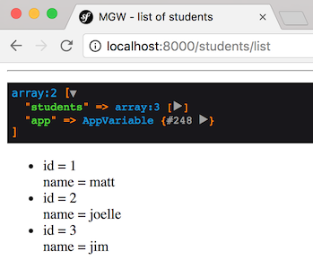
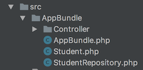

# Creating our own classes

## What we'll make (`project03`)

See Figure \ref{students_list} for a screenshot of the students list page we'll create this chapter.




## A collection of `Student` records

Although we'll be moving on to use a MySQL database soon for persistent data storage, let's start off with a simple DIY (Do-It-Yourself) situation of an entity class (`Student`) and a class to work with collections of those entities (`StudentRepository`).

We can then pass an array of `Student` records to a Twig template and loop through to display them one-by-one.

Here is our `Student.php` class:

```php
    class Student
    {
        private $id;
        private $name;

        public function __construct($id, $name){
            $this->id = $id;
            $this->name = $name;
        }

        public function getId()
        {
            return $this->id;
        }

        public function getName()
        {
            return $this->name;
        }
    }
```

So each student has simply an 'id' and a 'name', with public getters for each and a constructor.

Here is our `StudentRepository` class:

```php
    class StudentRepository
    {
        private $students = [];

        public function __construct()
        {
            $s1 = new Student(1, 'matt');
            $s2 = new Student(2, 'joelle');
            $s3 = new Student(3, 'jim');
            $this->students[] = $s1;
            $this->students[] = $s2;
            $this->students[] = $s3;
        }

        public function getAll()
        {
            return $this->students;
        }
    }
```

So our repository has a constructor which hard-codes 3 `Student` records and adds them to its array. There is also the public method `getAll()` that returns the array.

The simplest location for our own classes at this point in time, is in the onl 'bundle' we have, the `AppBundle`. So we can declare our PHP class files in directry `/src/AppBundle`. Figure \ref{app_bundle_dir} shows the `DefaultController.php` in this location.



Following the way Symfonhy projects use the PSR-4 namespacing system, we will namespace the class with exactly the same name as the directory they are located in.

```php
    namespace AppBundle;

    class Student
    {
        ... etc.
    }
```

## Using `StudentRepository` in a controller

Since we now have created our namespaced classes we can use them in a controller. Let's create a new controller to work with requests relating to `Student` objects. We'll name this `StudentController` and locate it in `/src/AppBundle/Controller` (next to our existing `DefaultController`).

Here is the listing for `StudentController.php` (note we need to add a `use` statement so that we can refer to class `StudentRepository`):

```php
    use AppBundle\StudentRepository;

    class StudentController extends Controller
    {
        /**
         * @Route("/students/list")
         */
        public function listAction(Request $request)
        {
            $studentRepository = new StudentRepository();
            $students = $studentRepository->getAll();

            $argsArray = [
                'students' => $students
            ];

            $templateName = 'students/list';
            return $this->render($templateName . '.html.twig', $argsArray);
        }
    }
```

We can see from the above that we have declared a controller method `listAction` in our `StudentController`. We can also see that this controller action will be invoked when the webapp receives a HTTP request with the route pattern `/students/list`.

The logic exectuted by the method is to get the array of `Student` records from an instance of `StudentRepository`, and then to pass this array to be rendered by the Twig template `students/list.html.twig`.

## Creating the Twig template to loop to display all students

We will now create the Twig template `list.html.twig', in locaton `/app/Resources/views/students`.


Figure \ref{students_dir} shows the 2 templates we are about to create in this location.


```html
    

    list of students

    

        {{ dump() }}

        <ul>
            
                <li>
                    id = {{ student.id }}
                    <br>
                    name = {{ student.name }}
                </li>
            
        </ul>

    
```


