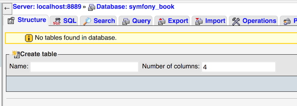

\mainmatter

# Doctrine the ORM

## What is an ORM?

The acronym ORM stands for:

- O: Object
- R: Relational
- M: Mapping

In a nutshell projects using an ORM mean we write code relating to collections of related **objects**, without having to worry about the way the data in those objects is actually represented and stored via a database or disk filing system or whatever. This is an example of 'abstraction' - adding a 'layer' between one software component and another. DBAL is the term used for separating the database interactions completed from other software components. DBAL stands for:

- DataBase
- Abstraction
- Layer

With ORMs we can interactive (CRUD^[CRUD = Create-Read-Update-Delete])
with persistent object collections either using methods of the object repositories (e.g. `findAll()`, `findOneById()`, `delete()` etc.), or using SQL-lite languages. For example Symfony uses the `Doctrine` ORM system, and that offers `DQL`, the Doctrine Query Language.

You can read more about ORMs and Symfony at:

- [Doctrine project's ORM page](http://www.doctrine-project.org/projects/orm.html)
- [Wikipedia's ORM page](https://en.wikipedia.org/wiki/Object-relational_mapping)
- (Symfony's Doctrine help pages)[http://symfony.com/doc/current/doctrine.html]

## Quick start
Once you've learnt how to work with Entity classes and Doctrine, these are the 3 commands you need to know:

1. `doctrine:database:create`
1. `doctrine:database:migrate`
1. `doctrine:fixtures:load`

This should make sense by the time you've reached the end of this chapter.


## Setting up the database credentials

The simplest way to connect your Symfony application to a MySQL database is by creating/editing the `parameters.yml`

```
    # This file is auto-generated during the composer install
    parameters:
        database_host: 127.0.0.1
        database_port: null
        database_name: symfony_book
        database_user: root
        database_password: null
```

This file is located in:

```
    /app/config/parameters.yml
```

Note that this file is include in the `.gitignore`, so it is **not** archived in your Git folder. Usually we need different parameter settings for different deployments, so while on your local, development machine you'll have certain settings, you'll need different settings for your public production 'live' website. Plus you don't want to accidently publically expose your database credentials on a open source Github page :-)

If there isn't already a `parameters.yml` file, then you can copy the `parameters.yml.dist` file end edit it as appropriate. You can replace `127.0.0.1` with `localhost` if you wish. If your code cannot connect to the database check the 'port' that your MySQL server is running at (usualy 3306 but may be different, for example my Mac MAMP server uses 8889 for MySQL for some reason). So my parameters look like this:


```
    parameters:
        database_host:     127.0.0.1
        database_port:     8889
        database_name:     symfony_book
        database_user:     symfony
        database_password: pass

```

We can now use the Symfony CLI to **generate** the new database for us. You've guessed it, we type:

```bash
    $ php bin/console doctrine:database:create
```

You should now see a new database in your DB manager. Figure \ref{new_db} shows our new `symfony_book` database created for us.



**NOTE** Ensure your database server is running before trying the above, or you'll get an error like this:

```
    [PDOException] SQLSTATE[HY000] [2002] Connection refused
```

now we have a database it's time to start creating tables and populating it with records ...