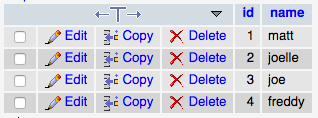

# Symfony approach to database CRUD

## Creating new student records

Let's add a new route and controller method to our `StudentController` class. This will define the `createAction()` method that receives parameter `$name` extracted from the route `/students/create/{name}`. Write the method code as follows:


```php
    /**
     * @Route("/students/create/{name}")
     */
    public function createAction($name)
    {
        $student = new Student();
        $student->setName($name);

        // entity manager
        $em = $this->getDoctrine()->getManager();

        // tells Doctrine you want to (eventually) save the Product (no queries yet)
        $em->persist($student);

        // actually executes the queries (i.e. the INSERT query)
        $em->flush();

        return new Response('Created new student with id '.$student->getId());
    }
```

The above now means we can create new records in our database via this new route. So to create a record with name `matt` just visit this URL with your browser:

```
    http://localhost:8000/students/create/matt
```

Figure \ref{new_student} shows how a new record `freddy` is added to the database table via route `/students/create/{name}`.


We can see these records in our database. Figure \ref{students_table} shows our new `students` table created for us.



## Updating the listAction() to use Doctrine

Doctrine creates repository objects for us. So we change the first line of method listAction() to the following:

```php
    $studentRepository = $repository = $this->getDoctrine()->getRepository('AppBundle:Student');
```

Doctrine repositories offer us lots of useful methods, including:

```php
    // query for a single record by its primary key (usually "id")
    $student = $repository->find($id);

    // dynamic method names to find a single record based on a column value
    $student = $repository->findOneById($id);
    $student = $repository->findOneByName('matt');

    // find *all* products
    $students = $repository->findAll();

    // dynamic method names to find a group of products based on a column value
    $products = $repository->findByPrice(19.99);
```

So we need to change the second line of our method to use the findAll() repository method:

```php
    $students = $studentRepository->findAll();
```

Our listAction() method now looks as follows:

```php
    public function listAction(Request $request)
    {
        $studentRepository = $this->getDoctrine()->getRepository('AppBundle:Student');
        $students = $studentRepository->findAll();

        $argsArray = [
            'students' => $students
        ];

        $templateName = 'students/list';
        return $this->render($templateName . '.html.twig', $argsArray);
    }
```

Figure \ref{student_list2} shows how a new record `freddy` is added to the database table via route `/students/create/{name}`.


## Deleting by id

Let's define a delete route `/students/delete/{id}` and a `deleteAction()` controller method. This method needs to first retreive the object (from the database) with the given ID, then ask to remove it, then flush the changes to the database (i.e. actually remove the record from the database). Note in this method we need both a reference to the entity manager `$em` and also to the student repository object `$studentRepository`:

```php
    /**
     * @Route("/students/delete/{id}")
     */
    public function deleteAction($id)
    {
        // entity manager
        $em = $this->getDoctrine()->getManager();
        $studentRepository = $this->getDoctrine()->getRepository('AppBundle:Student');

        // find thge student with this ID
        $student = $studentRepository->find($id);

        // tells Doctrine you want to (eventually) delete the Student (no queries yet)
        $em->remove($student);

        // actually executes the queries (i.e. the DELETE query)
        $em->flush();

        return new Response('Deleted student with id '.$id);
    }
```

## Updating given id and new name

We can do something similar to update. In this case we need 2 parameters: the id and the new name. We'll also follow the Symfony examples (and best practice) by actually testing whether or not we were successful retrieving a record for the given id, and if not then throwing a 'not found' exception.

```php
    /**
     * @Route("/students/update/{id}/{newName}")
     */
    public function updateAction($id, $newName)
    {
        $em = $this->getDoctrine()->getManager();
        $student = $em->getRepository('AppBundle:Student')->find($id);

        if (!$student) {
            throw $this->createNotFoundException(
                'No student found for id '.$id
            );
        }

        $student->setName($newName);
        $em->flush();

        return $this->redirectToRoute('homepage');
    }
```

Until we write an error handler we'll get Symfony style exception pages, such as shown in Figure \ref{no_student_exception} when trying to update a non-existant student with id=99.


Note, to illustrate a few more aspects of Symfony some of the coding in `updateAction()` has been written a little differently:

- we are getting the reference to the repository via the entity manager `$em->getRepository('AppBundle:Student')`
- we are 'chaining' the `find($id)` method call onto the end of the code to get a reference to the repository (rather than storing the repostory object reference and then invoking  `find($id)`). This is an example of using the 'fluent' interface^[read about it at [Wikipedia](https://en.wikipedia.org/wiki/Fluent_interface)] offered by Doctrine (where methods finish by returning an reference to their object, so that a sequence of method calls can be written in a single statement.
- rather than returning a `Response` containing a message, this controller method redirect the webapp to the route named `homepage`

We should also add the 'no student for id' test in our `deleteAction()` method ...

## Creating the CRUD controller automatically from the CLI

Here is something you might want to look into ...

```bash
    $ php app/console generate:doctrine:crud --entity=AppBundle:Student --format=annotation --with-write --no-interaction
```