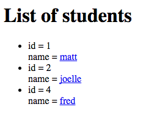

\mainmatter

# Completing CRUD and linking things together

## Show one record (given id)

Let's add a final method to read (the 'R' in CRUD!) and show a single record to the user.

```php
    /**
     * @Route("/students/show/{id}", name="students_show")
     */
    public function showAction($id)
    {
        $em = $this->getDoctrine()->getManager();
        $student = $em->getRepository('AppBundle:Student')->find($id);

        if (!$student) {
            throw $this->createNotFoundException(
                'No student found for id '.$id
            );
        }
        $argsArray = [
            'student' => $student
        ];

        $templateName = 'students/show';
        return $this->render($templateName . '.html.twig', $argsArray);
    }
```

We have named the route `students_show`. In fact we should go back and name **all* the routes we've just created controller methods for.

Our show method does the following:

- attempts to find a record for the given id (we get since we've an id in the route pattern, and a correspondingly named parameter for our method)
- throws an exception if no record could be found for that id
- creates a Twig argument array containing a single item congtaining our student record
- returns the Response created by rendering the `students/show.html.twig` template

## Our template

We now need to creat the `students/show.html.twig` template. This will be created in `app/Resources/views/students`:

```html
    

    show one student

    

    <h1>Show one student</h1>

    <p>
    id = {{ student.id }}

    <p>
    name = {{ student.name }}

    <hr>
    <a href="{{ path('students_list') }}">list of students</a>

    
```

This templates does the following:

- extends the base template and defines a page title
- shows a level 1 heading, and paragraphs for the id and name
- offers a link back to the list of students (using the route name `students_list`)

So we'd better ensure the `listAction()` controller method names its path with this identifier:

```php
    /**
     * @Route("/students/list", name="students_list")
     */
    public function listAction(Request $request)
    {
        ... etc
    }
```

## Making each name in the list be a link to its show page

Let's update our list template so that each name is itself a link to the show page (giving the id of each record).

A first attempt could be like this:

```html
    <a href="{{ path('students_show') }}/{{ student.id }}">
    {{ student.name }}
    </a>
```

But we get a Symfony error when we attempt to display this list page, complaining:

```
    An exception has been thrown during the rendering of a template ("Some mandatory parameters are missing ("id") to generate a URL for route "students_show".").
```

Symfony can't see that we're trying to add on the id after the show route. So we need to pass the id parameter inside the Twig `path()` function as follows:

```html
    <a href="{{ path('students_show', {id:student.id}) }}">
        {{ student.name }}
    </a>
```

There are lots of round and curly brackets all over the place, but try to remember that `path()` is a Twig function, taking the route name as the first parameter and the id (from student.id) as the second parameter.

Figure \ref{names_links} shows our list of students with the names as links.

