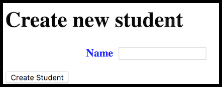

# Customising the display of generated forms

## Understanding the 3 parts of a form  (`project10`)

In a controller we  create a `$form` object, and pass this as a Twig variable to the template `form`.
Twig renders the form in 3 parts:

- the opening `<form>` tag
- the sequence of form fields (with labels, errors and input elements)
- the closing `</form>` tag

This can all be done in one go (using Symfony/Twig defaults) with the Twig `form()` function, or we can use Twigs  3 form functions for rendering (displaying) each part of a form, these are:

- `form_start()`
- `form_widget()`
- `form_end()`


So we could write the `body` block of our Twig template (`/app/Resources/views/students/new.html.twig`) for the new `Student` form to the following:

```html
    
        <h1>Create new student</h1>
        {{ form_start(form) }}
        {{ form_widget(form) }}
        {{ form_end(form) }}
    
```

Although since we're not adding anything between these 3 Twig functions' output, the result will be the same form as before.

## Using a Twig form-theme template

Symfony provides several useful Twig templates for common form layouts.

These include:

- wrapping each form field in a `<div>`
    - form_div_layout.html.twig

- put form inside a table, and each field inside a table row `<tr>` element
    - form_table_layout.html.twig

- Boostrap CSS framework div's and CSS classes
    - bootstrap_3_layout.html.twig

## DIY (Do-It-Yourself) form display customisations

Each form field can be rendered all in one go in the following way:

```
    {{ form_row(form.<FIELD_NAME>) }}
```

For example, if the form has a field `name`:

```
    {{ form_row(form.name) }}
```

So we could display our new student form this way:

```
    
        <h1>Create new student</h1>
        {{ form_start(form) }}

        {{ form_row(form.name) }}
        {{ form_row(form.save) }}

        {{ form_end(form) }}
    
```

## Customising display of parts of each form field

Alternatively, each form field can have its 3 constituent parts rendered separately:

- label (the text label seen by the user)
- errors (any validation error messages)
- widget (the form input element itself)

For example:

```
    <div>
        {{ form_label(form.name) }}

        <div class="errors">
        {{ form_errors(form.name) }}
        </div>

        {{ form_widget(form.name) }}
    </div>
```
So we could display our new student form this way:

```
    
        <h1>Create new student</h1>
        {{ form_start(form) }}

    <div>
        <div class="errors">
        {{ form_errors(form.name) }}
        </div>

        {{ form_label(form.name) }}

        {{ form_widget(form.name) }}
    </div>

    <div>
        {{ form_row(form.save) }}
    </div>

        {{ form_end(form) }}
    
```

The above would output the following HTML (if the errors list was empty):

```html

    <div>
        <div class="errors">

        </div>

        <label for="form_name" class="required">Name</label>

        <input type="text" id="form_name" name="form[name]" required="required" />
    </div>
```

## Adding some CSS style to the form

We could, of course add some CSS so style labels nicely. We can add a `stylesheets` block to our Twig template:

```css
    
    <style>
        label {
            display: inline-block;
            float: left;
            width: 10rem;
            padding-right: 0.5rem;
            font-weight:bold;
            color: blue;
            text-align: right;
        }

        .form-field {
            padding-bottom: 1rem;
        }
    </style>
    
```

We can edit our `body` block to add the CSS class `form-field` to the `<div>` containing our `name` form field elements:

```html
    
        <h1>Create new student</h1>
        {{ form_start(form) }}

        <div class="form-field">
            <div class="errors">
                {{ form_errors(form.name) }}
            </div>

            {{ form_label(form.name) }}

            {{ form_widget(form.name) }}
        </div>

        <div>
            {{ form_row(form.save) }}
        </div>

        {{ form_end(form) }}
    
```

Note - by displaying errors for field `name` before the label, we ensure the label will always 'float' left of the text input box from the form widget.

Figure \ref{form_with_css} shows what our CSS styled form looks like to the user.




Learn more at:

- [The Symfony form customisation page](https://symfony.com/doc/current/form/form_customization.html)


## Specifying a form's **method** and **action**

While Symfony forms default to `POST` submission and a postback to the same URL, it is possible to specify the method and action of a form created with Symfony's form builder. For example:

```php
    $formBuilder = $formFactory->createBuilder(FormType::class, null, array(
        'action' => '/search',
        'method' => 'GET',
    ));
```


Learn more at:

- [Introduction to the Form component](https://symfony.com/doc/current/components/form.html)

