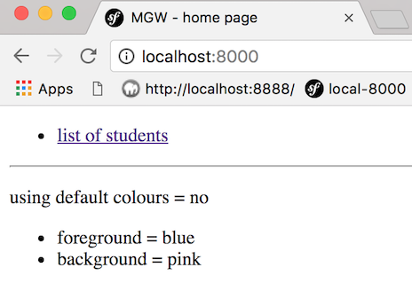
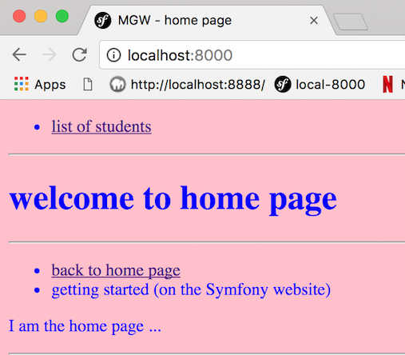

# Introduction to Symfony sessions

## Remembering foreground/background colours in the session (`project12`)

Let's start out Symfony sessions learning with the ability to store (and remember) foreground and background colours^[I'm not going to get into a colo[u]rs naming discussion. But you may prefer to just always use US-English spelling (*sans* 'u') since most computer language functions and variables are spelt the US-English way]. First let's add some HTML in our `index.html.twig` page to display the value of our 2 stored values.

We will assume we have 2 Twig variables:

- `colours` - an associative array in the form:

    ```php
    colours = [
        'foreground' => 'blue',
        'background' => 'pink'
    ]
    ```

- `default_colours` - a string ('yes' / 'no') value, telling us whether or not our colours came from the session, or are defaults due to no array being found in the session

here is the Twig HTML to output the values of these variables:

```html
    <p>
        using default colours = {{ default_colours }}
    </p>
    <ul>
        
            <li>
            {{ property }} = {{ colour }}
            </li>
        
    </ul>
```

Note that Twig offers a key-value array loop just like PHP, in the form:

```html
    
```

## Twig default values (in case **nothing** in the session)

Let's write some Twig code to attempt to read the `colours` array from the SESSION, but failing that, then setting default values into Twig variable `colours`.

First we assume we'll get a value from the session (so we set `default_colours` to `no`), and we attempt to read the session variable array `colours` and store it in Twig variable `colours`. To read a value from the Symfony `app` variable's `session` property we write a Twig expressison in the form `app.session.get('<attribute_key>')`:

```html
    

    
```


Now we test whether or not `colours` is NULL (i.e. we could not read anything in the session for the given key). We test if a variable is `null` with Twig expression `if <variable> is null`:

```html
    
        

        
    
```

As we can see, if `colours` was NULL then we set `default_colors` to `yes`, and we use Twig's JSON-like format for setting key-value pairs in an array.

## Working with sessions in Symfony Controller methods

All we need to write to work with the current session object in a Symfony controller method is the following statement:

```
    $session = new Session();
```

Note, you also need to add the following `use` statement for the class using this code:

```php
    use Symfony\Component\HttpFoundation\Session\Session;
```

Note - do **not** use any of the stardard PHP command for working with sessions. Do all your Symfony work through the Symfony session API. So, for example, do not use either of these PHP functions:

```php
    session_start();
    session_destroy();
```


You can now set/get values in the session by making reference to `$session`.

Note: You may wish to read about **how to start a session in Symfony**^[While a session will be started automatically if a session action takes places (if no session was already started), the Symfony documentation recommends your code starts a session if one is required. Here is the code to do so: `$session->start()`, but to be honest it's simpler to rely on Symfony to decide when to start a new session, since sometimes integrating this into your controller logic can be tricky (especially with controller redirects). You'll get errors if you try to start an already started session ...].


## Symfony's 2 session 'bags'

We've already met sessions - the Symfony 'flash bag', which stores messages in the session for one request cycle.

Symfony also offers a second kind of session storage, session 'attribute bags', which store values for longer, and offer a namespacing approach to accessing values in session arrays.

We store values in the attribute bag as follows using the `session->set()` method:

```php
    $session->set('<key>', <value>);
```

Here's how we store our colours array in the Symfony application session from our controllers:

```php
    // create colours array
    $colours = [
        'foreground' => 'blue',
        'background' => 'pink'
    ];

    // store colours in session 'colours'
    $session = new Session();
    $session->set('colours', $colours);
```

We can clear everything in a session by writing:

        $session = new Session();
        $session->remove('electives');

        $session->clear();


## Storing values in the session in a controller action

We'll add code to store colours in the session to our `DefaultController->indexAction()` method (i.e. the website home page controller):

```php
    public function indexAction(Request $request)
    {
        // create colours array
        $colours = [
            'foreground' => 'blue',
            'background' => 'pink'
        ];

        // store colours in session 'colours'
        $session = new Session();
        $session->set('colours', $colours);

        $argsArray =  [
            'name' => 'matt'
        ];

        $templateName = 'index';
        return $this->render($templateName . '.html.twig', $argsArray);
    }
```

Figure \ref{colours_index} shows the output of the colours from the session array when visiting the website homepage.





Learn more at about Symfony sessions at:

- [Symfony and sessions](http://symfony.com/doc/current/components/http_foundation/sessions.html)

## Getting the colours into the HTML head `<style>` element (`project13`)

Since we have an array of colours, let's finish this task logically by moving our code into `_base.html.twig` and creating some CSS to actually set the foreground and background colours using these values.

So we remove the Twig code from template `index.html.twig` and paste it, slighly edited, into  `_base.html.twig` as follows.

Add the following **before** we start the HTML doctype etc.

```html
    

    {# default = blue #}
    
        
    
```

So now we know we have our Twig variable `colours` assigned values (either from the session, or from the defaults. Now we can update the `<head>` of our HTML to include a new `body {}` CSS rule, that pastes in the values of our Twig array `colours['foreground']` and `colours['background']`:

```
    <!DOCTYPE html>
    <html>
    <head>
        <meta charset="UTF-8" />
        <title>MGW - </title>

        <style>
            @import '/css/flash.css';
            
            

            body {
                color: {{ colours['foreground'] }};
                background-color: {{ colours['background'] }};
            }
        </style>
    </head>
```


Figure \ref{colours_css_index} shows our text and background colours applied to the CSS of the website homepage.




## Testing whether an attribute is present in the current session

Before we work with a session attribute in PHP, we may wish to test whether it is present. We can test for the existance of an attribute in the session bag as follows:

```php
    if($session->has('<key>')){
         //do something
     }
```

## Removing an item from the session attribute bag

To remove an item from the session attribute bag write the following:

```php
    $session->remove('<key>');
```

## Clearing all items in the session attribute bag

To remove all items from the session attribute bag write the following:

```php
    $session->clear();
```


