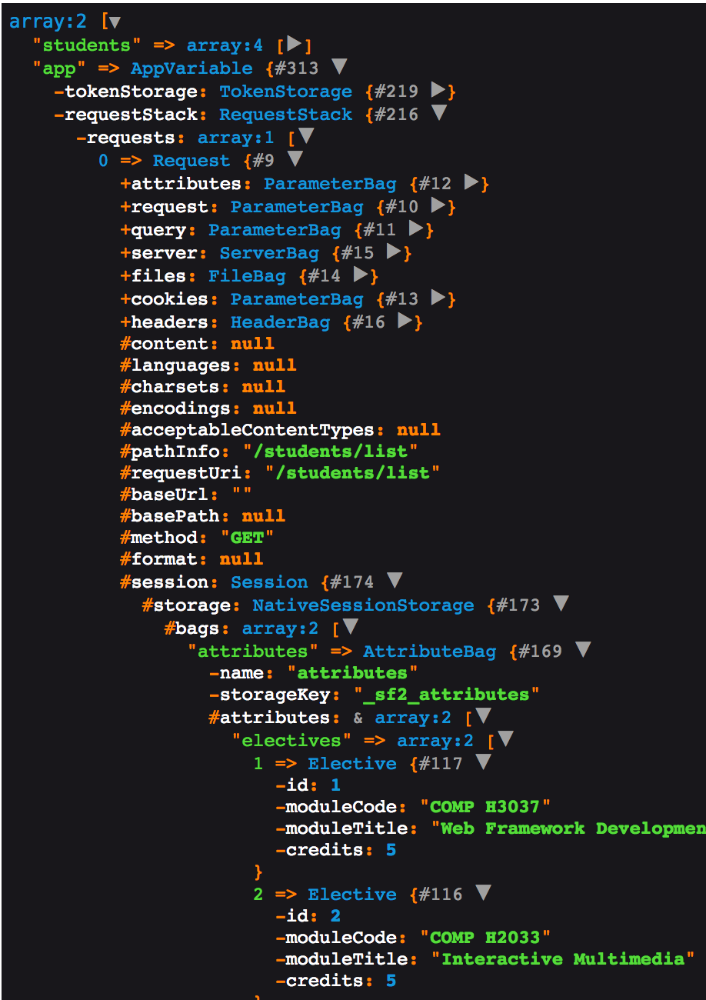
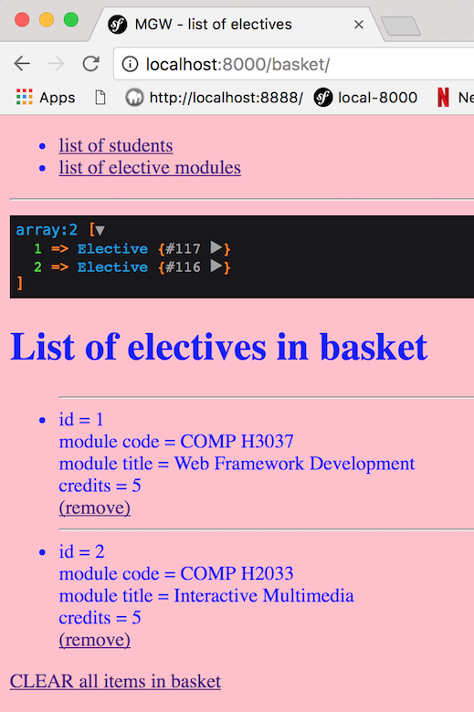
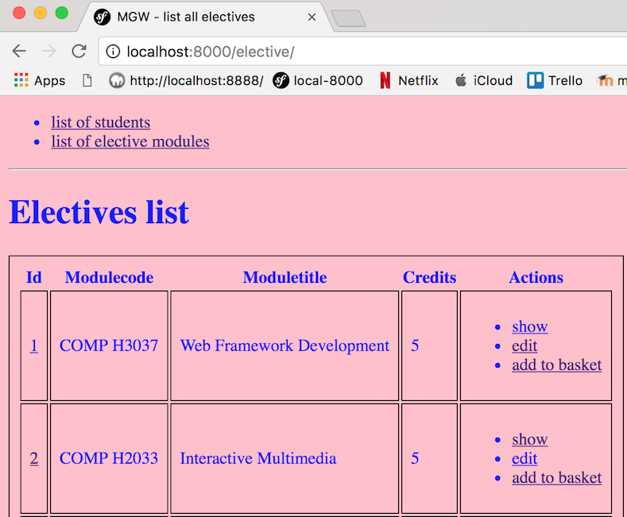

# Working with a session 'basket' of electives


## Shopping cart session attribute bag example (`project14`)

When you're leaning sessions, you need to build a 'shopping cart'! Let's imagine our students can select several subject elective 'modules', and store them in a 'basket' of electives.

We've created an `Elective` entity, and its CRUD controller and templates. So now let's add the 'shopping basket' functionality to add elective modules into a session basket.

We will have an `basket` item in the session, containing an array of `Elective` objects adding the the basket. This array will be indexed by the `id` property of each Elective (so we won't add the same module twice to the array), and items are easy to remove by unsetting.


## Debugging sessions in Twig

As well as the Symfony profiler, there is also the powerful Twig functiond `dump()`. This can be used to interrogate values in the session.

You can either dump **every** variable that Twig can see, with `dump()`. This will list arguments passed to Twig by the controller, plus the `app` variable, containing sesison data and other applicaiton object properties. Or you can be more specific, and dump just a particular object or variable. For example we'll be building an attribute stack session array named `basket`, and the contents of this array can be dumped in Twig with the following statement:

```
    {{ dump(app.session.get('basket')) }}
```

Figure \ref{twig_session_dump} shows our `basket[]` array in the session `Attribute Bag`, navigating through the Twig `dump()` output as follows:

```
    app> requestStack> requests[0]> session> storage> bags> attributes> basket[]
```



## Basket index route, to list contents of electives basket

We'll write our code in a new controller class `ElectiveBasketCobtroller.php` in directory `/src/AppBundle/Controller/`. Note that we have added the `@Route` prefix `/basket/` to all controller actions in this class by writing a  `@Route` annotation comment for the class declaration:

```php
    namespace AppBundle\Controller;

    use Sensio\Bundle\FrameworkExtraBundle\Configuration\Route;
    use Symfony\Bundle\FrameworkBundle\Controller\Controller;
    use AppBundle\Entity\Elective;
    use Symfony\Component\HttpFoundation\Session\Session;

    /**
     * Elective controller.
     *
     * @Route("/basket")
     */
    class ElectiveBasketController extends Controller
    {
```

Our electives basket controller index action is very simple, since all the work extacting values from the session will be done by our Twig template. So our index action simply returns the Twig rendering of template `basket/index.html.twig`:

```php
    /**
     * @Route("/", name="electives_basket_index")
     */
    public function indexAction()
    {
        // no need to put electives array in Twig argument array - Twig can get data direct from session
        $argsArray = [
        ];

        $templateName = 'basket/list';
        return $this->render($templateName . '.html.twig', $argsArray);
    }
```

## Controller method - `clearAction()`

Let's write another simple method next - a method to remove any `basket` attribute from the session. We can achieve this with the statement `$session->remove('basket')`:

```php
    /**
     * @Route("/clear", name="electives_basket_clear")
     */
    public function clearAction()
    {
        $session = new Session();
        $session->remove('basket');

        return $this->redirectToRoute('electives_basket_index');
    }
```

Note that we are redirecting to route `electives_basket_index`.

## Adding an Elective object to the basket

The logic to add an object into our session `basket` array requires a little work. First we need to get a PHP array `$electives`, that is either what is currently in the session, or a new empty array if no such array was found in the session:

```php
    /**
     * @Route("/add/{id}", name="electives_basket_add")
     */
    public function addToElectiveCart(Elective $elective)
    {
        // default - new empty array
        $electives = [];

        // if no 'electives' array in the session, add an empty array
        $session = new Session();
        if($session->has('basket')){
            $electives = $session->get('basket');
        }
```

Note above, that we are relying on the 'magic' of the Symfony param-converter here, so that the integer 'id' received in the request is converted into its corresponding Elective object for us.

Next we get the 'id' of the Elective object, and see whether it can be found already in array `$electives`. If if is not already in the array, then we add it to the array (with the 'id' as key), and store the updated array in the session under the attribute bag key `basket`:

```php
        // get ID of elective
        $id = $elective->getId();

        // only try to add to array if not already in the array
        if(!array_key_exists($id, $electives)){
            // append $elective to our list
            $electives[$id] = $elective;

            // store updated array back into the session
            $session->set('basket', $electives);
        }
```

Finally (whether we changed the session `basket` or not), we redirect to the basket index route:

```php
    return $this->redirectToRoute('electives_basket_index');
```

## The delete action method

The delete action method is very similar to the add action method. In this case we never need the whole Elective object, so we can keep the integer `id` as the parameter for the method.

We start (as for add) by ensuring we have a PHP variable array `$electives`, whether or not one was found in the session.

```php
    /**
     * @Route("/delete/{id}", name="electives_basket_delete")
     */
    public function deleteAction(int $id)
    {
        // default - new empty array
        $electives = [];

        // if no 'electives' array in the session, add an empty array
        $session = new Session();
        if($session->has('basket')){
            $electives = $session->get('basket');
        }
```

Next we see whether an item in this array can be found with the key `$id`. If it can, we remove it with `unset` and store the updated array in the session attribute bag with key `basket`.

```php

        // only try to remove if it's in the array
        if(array_key_exists($id, $electives)){
            // remove entry with $id
            unset($electives[$id]);

            if(sizeof($electives) < 1){
                return $this->redirectToRoute('electives_basket_clear');
            }

            // store updated array back into the session
            $session->set('basket', $electives);
        }
```


Finally (whether we changed the session `basket` or not), we redirect to the basket index route:
```php
    return $this->redirectToRoute('electives_basket_index');
```

## The Twig template for the basket index action

The work extacting the array of electives in the basket and displaying them is the task of template `index.html.twig` in `/app/Resources/views/basket`.

First, we attempt to retrieve item `basket` from the session, and also Twig `dump()` this session attribute:

```html
    

    {{ dump(app.session.get('basket')) }}
```

Next we have a Twig `if` statement, displaying an empty basket message if `basket_electives` is null (i.e.

```html
    
        <p>
            you have no electives in your basket
        </p>
```


The we have an `else` statement (for when we did retrieve an array), that loops through creating an unordered HTML list of the basket items:
```
    
        <ul>
            
                <li>
                    <hr>
                    id = {{ elective.id }}
                    <br>
                    module code = {{ elective.moduleCode }}
                    <br>
                    module title = {{ elective.moduleTitle }}
                    <br>
                    credits = {{ elective.credits }}
                    <br>
                    <a href="{{ path('electives_basket_delete', { 'id': elective.id }) }}">(remove)</a>
                </li>
            
        </ul>
    
```

Note that a link to the `delete` action is offered at the end of each list item.

Finally, a paragraph is offered, containing a list to clear all items from the basket:

```html
    <p>
        <a href="{{ path('electives_basket_clear') }}">CLEAR all items in basket</a>
    </p>
```


Figure \ref{electives_basket} shows a screenshot of the basket index page, listing each item in the session array.




## Adding the 'add to basket' link in the list of electives

To link everything together, we can now add a link to 'add to basket' in our electives index template. So when we see a list of electives we can add one to the basket, and then be redirected to see the updated basket of elective modules. We see below an extra list item for path `electives_basket_add` in template `index.html.twig` in directory `/app/Resources/views/elective/`:

```html
    
        <tr>
            <td><a href="{{ path('elective_show', { 'id': elective.id }) }}">{{ elective.id }}</a></td>
            <td>{{ elective.moduleCode }}</td>
            <td>{{ elective.moduleTitle }}</td>
            <td>{{ elective.credits }}</td>
            <td>
                <ul>
                    <li>
                        <a href="{{ path('elective_show', { 'id': elective.id }) }}">show</a>
                    </li>
                    <li>
                        <a href="{{ path('elective_edit', { 'id': elective.id }) }}">edit</a>
                    </li>
                    <li>
                        <a href="{{ path('electives_basket_add', { 'id': elective.id }) }}">add to basket</a>
                    </li>
                </ul>
            </td>
        </tr>
    
```

Figure \ref{add_to_basket} shows a screenshot of the list of elective modules page, each with an 'add to basket' link.



