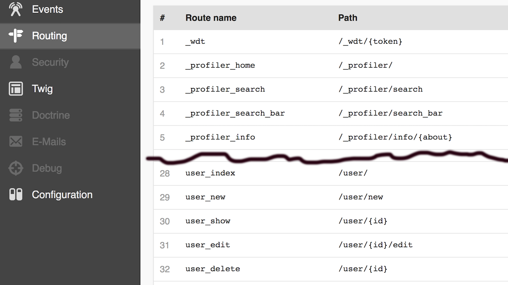
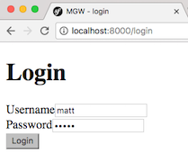
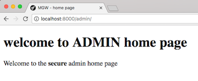
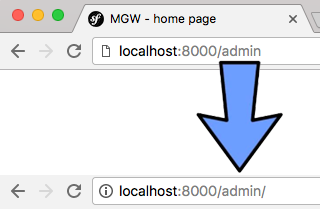
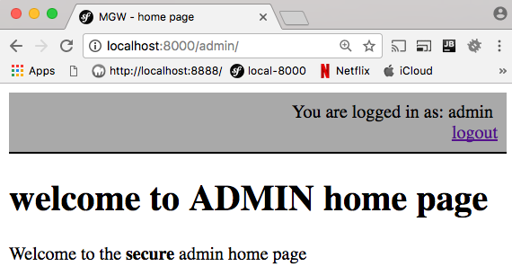

# Simple authentication (logins!) with Symfony sessions

## Create a `User` entity (`project15`)

Let's use the CLI to generate a `User` entity for us. We'll use the `--no-interaction` option and specify 2 string fields (each with length 255) for `username` and `password`:

```bash
php bin/console generate:doctrine:entity --no-interaction --entity=AppBundle:User
--fields="username:string(255) password:string(255)"
```

For now we won't worry about hashing the password - we'll learn how to do that later.

## Create Database table for our entity

Now let's use the CLI to update our Database schema and create a table corresponding to our new entity:

```bash
     $ php bin/console doctrine:schema:update --force
```

## Create `User` CRUD from CLI

Now let's create a CRUD controller for users:

```php
    php bin/console generate:doctrine:crud --entity=AppBundle:User --format=annotation
    --with-write --no-interaction
```
We now have a new controller class `UserController`, and also new view templates^[If you use `_base.html.twig` you'll have to edit the `extends` statement for each of these templates, since `base.html.twig` is assumed and automatically coded.]:

```bash
    /app/Resources/views/user/edit.html.twig
    /app/Resources/views/user/index.html.twig
    /app/Resources/views/user/new.html.twig
    /app/Resources/views/user/show.html.twig

```


## New routes (from annotations of controller methods)

Let's look at the new routes added by our generated CRUD controller. We can do this two ways:

- from the CLI command `php bin/console debug:router`
- selecting 'Routes' from the Symfony profiler page


Figure \ref{user_routes} shows a screenshot the Symfony of the profiler page listing all routes (hint - enter an invalid route and it will list them all, e.g. `/user99`).





We can see that these automatically generated routes are very 'succinct' (using as few words as possible). The sequence is important, also the HTTP methods (or simulated methods like `DELETE`).

## WARNING - watch our for 'verbs' being interpreted as entity 'id's ...

Imagine we write a new method, `loginAction()` at the **end** of our `UserController`, with the route annotation `/user/login`. When requested with the HTTP `GET` method, the show route `/user/{id}` will match before it gets down to the `/user/login` route pattern. The Symfony param-converted will then attempt to retreive a `User` record from the database with an 'id' value of `login`, and will fail. This will result in the param-converted throwing a 404-not found exception.

Figure \ref{not_found_id_login} shows a screenshot of the exception thrown.


If we look in the profiler it will tell us which route it matched with. Figure \ref{not_found_id_login_routes} shows the profiler telling us it matched route `/user/{id}`.


We can solve this problem in several different ways. Let's solve it by creating a separate `LoginController` class, with routes `/login` and `/logout`. Since these routes will not be prefixed by `/user` neither word 'login' or 'logout' will be interpreted as an 'id' for a user. Other solutions include:

- locating the `loginAction()` method, and its associated route, earlier in the `UserController` than the `showAction()`. Although the less we have to rely on the **sequence** of methods in a class, the less chance we'll encounter issues like this.

- adding a 'verb' for each action's route. So the `showAction()` method will have route `/user/show/{id}` and the  `deleteAction()` method will have route `/user/delete/{id}`, and so on. This is why the `editAction()` route ends with `/edit` (although putting the verb after the parameter seems odd to me ...).

## Create a 'login' Twig template (`project16`)

Before we create the `LoginController` PHP class  let's first create the Twig template to display the login form.

Let's just copy the `/user/new.html.twig` template (in directory `/app/Resources/views`) created with our CRUD - since a login (just as with new user) needs a form asking for 'username' and 'password'. We'll copy that to `/login.html.twig` (in the root views directory of `/app/Resources/views`). We'll change the level 1 heading and button label to `Login`, and remove the `Back to the list` link:
, and change the name of the submit button to `l

```html
    

    
        <h1>Login</h1>
        {{ form_start(form) }}
            {{ form_widget(form) }}
            <input type="submit" value="Login" />
        {{ form_end(form) }}
    
```

As we can see above, this Twig template is now basically a level 1 HTML heading `Login`, the start and end form tags (via Twig functions `form_start` and `form_end`), and then the form widget (input fields and labels etc.), plus a regular `Login` submit button.

Since we can anticipate that we may wish to display flash login error messages to the user, we'll add a `<div>` with CSS class `flash-error` (pink background and some padding) after the level 1 heading:


```html
    

    
        <h1>Login</h1>

        
            <div class="flash-error">
                
                    {{ msg }}
                
            </div>
        

        {{ form_start(form) }}
            {{ form_widget(form) }}
            <input type="submit" value="Login" />
        {{ form_end(form) }}
    
```

## A `loginAction()` in a new `SecurityController`

Now we'll create a new controller class to handle login/logout/authentication etc. In directory `/src/AppBundle/Controllers` create new class `SecurityController`. We can base method `loginAction()` for route `/login` on a copy of method `UserController->newAction()`.

We need to do the following:


- change the route annotation comment to `@Route("/login", name="login")`
- change method name to `loginAction()`
- for now just delete all the statements inside the `if` statement for a succsfully submitted form (so after submission of the form, we just see the form again - note the form is 'sticky' since the `$user` object is rem
- the name of the Twig template is simply `login`

```php
    /**
     * login form
     *
     * @Route("/login", name="login")
     * @Method({"GET", "POST"})
     */
    public function loginAction(Request $request)
    {
        $user = new User();
        $form = $this->createForm('AppBundle\Form\UserType', $user);
        $form->handleRequest($request);

        if ($form->isSubmitted() && $form->isValid()) {
        }

        $argsArray = [
            'user' => $user,
            'form' => $form->createView(),
        ];

        $templateName = 'login';
        return $this->render($templateName . '.html.twig', $argsArray);
    }
```


## Problem - the Symfony User form renders password as visible plain text

While we saved a little time and energy re-using the new User form for our login form, we can see from the screenshot in Figure \ref{login_plain_text} that the password field is rendered in HTML as visible plain text.


This is because the default `UserType` form, that was created as part of the CRUD generation, saw that `password` was a text field in the Entity `User`, so by default generates a plain text HTML input field.

** Huh?? the `UserType` form?? **

Yes, part of the CRUD generation also involves creating a class for each entity's Form. So in  `/src/AppBundle/Form` the `UserType` form class that was created. If we look carefuly at the code we copied from  `UserController->newAction()` we see that to create the form from a `User` object we are Symfony to use class `AppBundle\Form\UserType`:


```php
    $form = $this->createForm('AppBundle\Form\UserType', $user);
```


We can change this by specifying that we want any forms displaying the `User` passowrd field to be rendered using the `PasswordType` Symfony form type. We just have to add this in to the `UserType` form class that was created in `/src/AppBundle/Form/UserType.php`:

```php
class UserType extends AbstractType
{
    /**
     * {@inheritdoc}
     */
    public function buildForm(FormBuilderInterface $builder, array $options)
    {
        $builder->add('username')->add('password');
    }
```

We need to add `PasswordType::class` to the part where the `password field is added to the form:

```php
class UserType extends AbstractType
{
    /**
     * {@inheritdoc}
     */
    public function buildForm(FormBuilderInterface $builder, array $options)
    {
        $builder->add('username')->add('password', PasswordType::class);
    }
```

We also need to add the corresponding `use` statement so that this class knows about the `PasswordType` class we are using:

```php
    use Symfony\Component\Form\Extension\Core\Type\PasswordType;
```

Figure \ref{login_wildcard} shows a wildcarded password HTML form field now.




## Handling login form submission

We can now begin our work on handling the POST submission of login details. Let us abstract away the task of authentication to a method (we'll write in a minute) `authenticate()`. So we can now write the content of our `if(submitted and valid)` statement block to do the following:

- IF successful authentication for contents of `$user`
- THEN store `$user` in the session and redirect to a secure admin home page
- ELSE

    -- add an error to the flash bag

    -- clear the password field (login forms should not have 'sticky' passwords) and recreate the form with this updated user object

    -- then fall through to display the form again

Here is this login implemented in our `loginAction()` method:

```php
    if ($form->isSubmitted() && $form->isValid()) {
        if($this->canAuthenticate($user)) {
            // store user in session
            $session->set('user', $user);

            // redirect to ADMIN home page
            return $this->redirectToRoute('admin_index');
        } else {
            $this->addFlash(
                'error',
                'bad username or password, please try again'
            );

            // create new form with user that has no password - password should not be 'sticky'
            $user->setPassword('');
            $form = $this->createForm('AppBundle\Form\UserType', $user);

            // fall through to login form at end of this method
        }
    }
```


## An Admin home page (to test authentication)

Let's add the admin controller, with an action for an admin homepage (the route named `admin_index` which we redirect to after a valid login). Figure \ref{admin_home1} shows this admin home page. At present we can visit this page with no login authentication with request URL `/admin/`.




```php
    /**
     * Class AdminController
     * @package AppBundle\Controller
     *
     * @Route("/admin")
     */
    class AdminController extends Controller
    {
        /**
         * @Route("/", name="admin_index")
         */
        public function indexAction(Request $request)
        {
            $templateName = '/admin/index';
            return $this->render($templateName . '.html.twig', []);
        }
    }
```


NOTE: Why have route prefix for a class when there is only one route? Well, having a route prefix means Symfony resolves `/admin` with no trailing slash as `/admin/` with no complaining! Figure \ref{prefix_added} shows how a trailing forward slash is automatically added to a request to `/admin`.





Let's add a Twig template `app/Resources/views/admin/index.html.twig` for a simple admin home page:

```html
    

    home page

    
        <h1>welcome to ADMIN home page</h1>

        <p>
            Welcome to the <strong>secure</strong> admin home page
        </p>
    
```


## Authenticating against hard-coded credentials and storing User object in the session

We can now complete our session-based security, by implementing our authenticate() method in the SecurityController, and storing a User object in the session after successful login. Here is the code for that mehtod (where we hardcode valid username and password 'admin'):

```php
    /**
     * @param User $user
     * @return bool
     *
     * return whether or not contents of $user is a valid username/password combination
     */
    public function canAuthenticate(User $user)
    {
        $username = $user->getUsername();
        $password = $user->getPassword();

        return ('admin' == $username) && ('admin' == $password);
    }
```

We can now add SESSION logic to our  `AdminController->indexAction()` method, testing for a  `user` token in the SESSION before allowing display of the admin home page. We need to:

- get a reference to the current session

- test whether there is a token user in the current session (if yes, we can go ahead and render the admin home page)

- if no user token in the session, then we'll add a flash error to the session Flash bag, and redirecet to the login page

**NOTE** Due to the way redirects work in Symfony 3, flash messages live for 2 requests during a redirect, so we need to clear the flash bag before adding the message, otherwise we'll see the message twice ... a bit odd but this approach seems to work ...


```php
    public function indexAction(Request $request)
    {
        $session = new Session();

        if ($session->has('user')){
            $templateName = '/admin/index';
            return $this->render($templateName . '.html.twig', []);
        }

        // if get here, not logged in,
        // empty flash bag and create flash login first message then redirect
        $session->getFlashBag()->clear(); // avoids seeing message twice ...
        $this->addFlash(
            'error',
            'please login before accessing admin'
        );

        return $this->redirectToRoute('login');
    }
```

 Figure \ref{admin_redirect} shows automatic redirection to the login page, when user attempts to view admin home page when not logged in.


If we login with the credentials username='`admin`' and password='`admin`', we get to see the admin home page, and we can see, from the Symfony profiler, that a user object is stored in the session (See Figure \ref{user_in_session}).


## Informing user if logged in

If the user is accessing the admin pages, let's inform them of the user they are logged-in as, and offer them a logout link. We can add some CSS for a page header in `/web/css/header.css` to show a grey shaded header with some padding and right aligned text (and add an import statement for this stylesheet to `_base.html.twig`):

```css
    header {
        text-align: right;
        padding: 0.5rem;
        border-bottom: 0.1rem solid black;
        background-color: darkgray;
    }
```

We can also add some Twig logic to our  `_base.html.twig` template to display (on every page) login detaila, and login/logout link as appropriate:

```html
    

    
        <p>
            you are not logged in: <a href="{{ path('login') }}">login</a>
        </p>
    
        <header>
            You are logged in as: {{ user.username }}
            <br>
            <a href="{{ path('logout') }}">logout</a>
        </header>
    
```


Figure \ref{header_logout} shows automatic redirection to the login page, when user attempts to view admin home page when not logged in.



## Working with different user roles

Often we need to identify **which** kind of user has logged in. This can be done by extending our User entity to have a 'role' property. Either make this an integer (foreign key to a `Role` Entity), or just have text values. Symfony's own security system follows the PHP constant naming convention of upper case, underscore separated names for roles, such as:

- `ROLE_USER`
- `ROLE_ADMIN`
- `ROLE_MODERATOR`
- etc.

So I suggest you follow this. The steps you'd need to take would include:

1. update the `User` entity to have a string 'role' property
1. regenerate the getters and setters
1. regenerate the CRUD (and Form)
1. update the form, so that passwords are rendered as password fields
1. edit your secure page controller methods to check for user roles (e.g. admin home page may require `ROLE_ADMIN` in the user object in the session)

## Moving on ... the Symfony security system

Rather than this D.I.Y. (Do-It-Yourself) approach to security with sessions, it may be wise to move forward and learn about Symfony's powerful security component:

- [The Symfony Security system](http://symfony.com/doc/current/security.html)