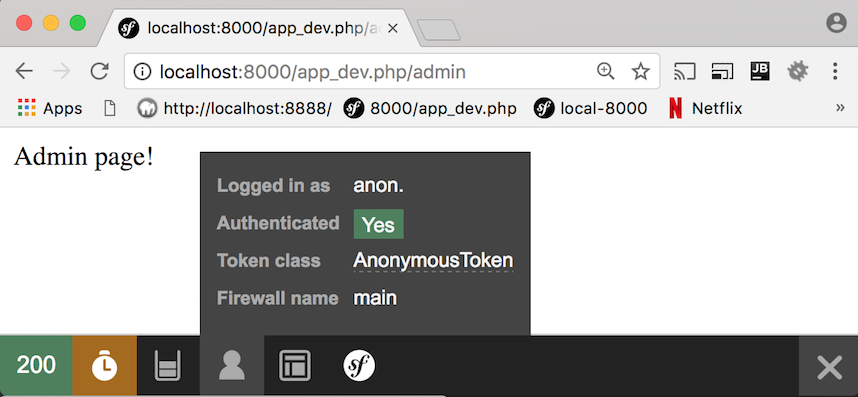
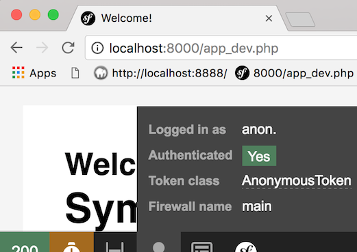
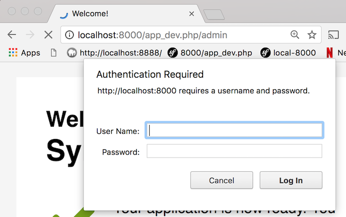
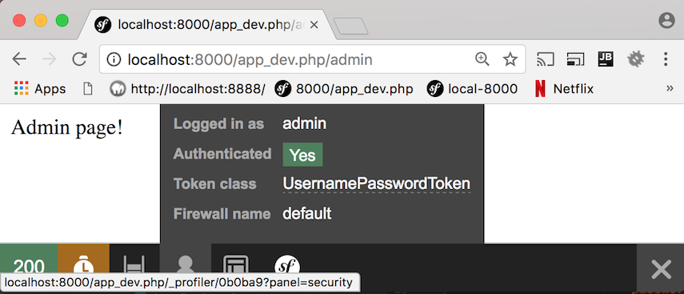

# Introduction to Symfony security features

## Create a new `blog` project (`project17`)

Create a brand new project named `blog` (or whatever you want). See Appendix \ref{appendix_new_project} for a quick list of actions to create a new Symfony project.


## Adding an unsecured admin home page

Now let's create an `AdminController` in `/src/AppBuundle/Controller`, with an index route for route `/admin`. At some later point you add a nice Twig template to create the page, but for now we'll settle for a one-line hardcoded `Response` of `<html><body>Admin page!</body></html>`:


```php
    namespace AppBundle\Controller;

    use Sensio\Bundle\FrameworkExtraBundle\Configuration\Route;
    use Symfony\Bundle\FrameworkBundle\Controller\Controller;
    use Symfony\Component\HttpFoundation\Response;

    /**
     * @Route("/admin")
     */
    class AdminController extends Controller
    {
        /**
         * @Route("/", name="admin_index")
         */
        public function adminAction()
        {
            return new Response('<html><body>Admin page!</body></html>');
        }
    }
```

As we can see in Figure \ref{admin_unsecured}, at present this is unsecured and we can access it in our browser via URL.


```
    http://localhost:8000/app_dev.php/admin
```

We can see the route is unsecured by looking at the user information from the Symfony debug bar when visiting the default home page.



## Security a route with annotation comments

We are going to add a security annotation comment to declare that the admin index route is only permitted for users with `ROLE_ADMIN`. We need to add a `use` statement, so that the annotation comments for `@Security` are parsed correctly:

```php
    use Sensio\Bundle\FrameworkExtraBundle\Configuration\Security;
```

We can now add an annotation comment in the same comment DOCBLOCK as the route annotation (immediately before the controller method), requiring users to have `ROLE_ADMIN` to be permitted to access this route:

```php
    <?php
    namespace AppBundle\Controller;

    use Sensio\Bundle\FrameworkExtraBundle\Configuration\Route;
    use Symfony\Bundle\FrameworkBundle\Controller\Controller;
    use Symfony\Component\HttpFoundation\Response;
    use Sensio\Bundle\FrameworkExtraBundle\Configuration\Security;

    /**
     * @Route("/admin")
     */
    class AdminController extends Controller
    {
        /**
         * @Route("/admin")
         * @Security("has_role('ROLE_ADMIN')")
         */
        public function adminAction()
        {
            return new Response('<html><body>Admin page!</body></html>');
        }
    }
```


Now if we try to access `http://localhost:8000/app_dev.php/admin` we'll see (as in Figure \ref{admin_denied}) an error stating that `full authentication is required to access this resource` - which is impressive since we have not yet defined any users or authentication methods for users!


## Read some of the Symfony security documents

There are several key Symfony reference pages to read when starting with security. These include:

- [Introduction to security](http://symfony.com/doc/current/security.html)

- [How to build a traditional login form](http://symfony.com/doc/current/security/form_login_setup.html)

- [Using CSRF protection](http://symfony.com/doc/current/security/csrf_in_login_form.html)


## Core features about Symfony security

There are several related features and files that need to be understood when using the Symnfony security system. These include:

- **firewalls**
- **providers** and **encoders**
- **route protection**
- user **roles**

Core to Symfony security are the **firewalls** defined in `app/config/security.yml`. Symfony firewalls declare how route patterns are protected (or not) by the security system. Here is its default contents (less comments - lines starting with hash `#` character):

```yaml
    security:
        providers:
            in_memory:
                memory: ~

        firewalls:
            dev:
                pattern: ^/(_(profiler|wdt)|css|images|js)/
                security: false

            main:
                anonymous: ~
```

Symfony considers **every** request to have been authenticated, so if no login action has taken place then the request is considered to have been authenticated to be **anonymous** user `anon`. We can see in this `anon` user in Figure \ref{anon_user} this looking at the user information from the Symfony debug bar when visiting the default home page.




A Symfony **provider** is where the security system can access a set of defined users of the web application. The default is simply `in_memory` - although usually larger applications have users in a database or from a separate API. We see that the `main` firewall simply states that users are permitted (at present) any request route pattern, and anonymous authenticated users (i.e. ones who have not logged in) are permitted.

**NOTE** In some Symfony documentation you'll see `default` instead of `main` for the default firewall. Both seem to work the same way (i.e. as the default firewall settings). So choose one and stick with it. Since my most recent new Symfony project called this `main` in the `security.yml` file I'll stick with that one for now ...

The `dev` firewall allows Symfony development tools (like the profiler) to work without any authentication required. Leave it in `security.yml` and just ignore the `dev` firewall from this point onwards.

## Using default browser basic HTTP authentication

Let's tell Symfony to use the web browser's built-in HTTP login form to handle username/password input for us (we'll add a custom login form later). We do this by adding  a line^[In fact we can simply uncomment the provided line - just remove the has `#` symbol] at the end of our `security.yml` file, stating that authentication will be via the `http_basic` method:

```yaml
    security:
        providers:
            in_memory:
                memory: ~

        firewalls:
            dev:
                pattern: ^/(_(profiler|wdt)|css|images|js)/
                security: false

            main:
                anonymous: ~
                http_basic: ~
```

If we try to access `http://localhost:8000/app_dev.php/admin` again we'll see the browser default username/password login form, as shown in Figure \ref{http_basic_form}.



## Defining some users and their roles

Let's hard-code some users. Symfony looks at the **user providers** for where to find users and their credentials. We can hard code some users in the `memory` provider in `security.yml`. Let's define the following users:

- `user` (password `user`) with `ROLE_USER`
- `admin` (password `admin`) with `ROLE_ADMIN`
- `matt` (password `smith`) with `ROLE_ADMIN`

We add these users in the `memory` section of the `providers` section of `security.yml`. Note we also must also define the `encoder` that user's passwords are encoded with. For now we'll just use un-encoded `plaintext`. So we add an `encoders` section to `security.yml` too^[If you don't declare an encoder you'll get a `No encoder has been configured` Exception error message.].

```yaml
security:
    encoders:
        Symfony\Component\Security\Core\User\User: plaintext

    providers:
        in_memory:
            memory:
                users:
                    user:
                        password: user
                        roles: 'ROLE_USER'
                    admin:
                        password: admin
                        roles: 'ROLE_ADMIN'
                    matt:
                        password: smith
                        roles: 'ROLE_ADMIN'

    firewalls:
        dev:
            pattern: ^/(_(profiler|wdt)|css|images|js)/
            security: false

        default:
            anonymous: ~
            http_basic: ~
```

Figure \ref{admin_access} shows successful access to the admin home page after a login of `uername=admin` and `password=admin`. Figure \ref{admin_token} shows us in the Symfony profiler that the user `admin` has the security token `USER_ADMIN`.




## Security a route - method 2 - `security.yml` access control

The Symfony security examples offer a second method of securing routes, by adding an `access_contol` section to `security.yml`. Just as with the annotation comment, we declare that route `/admin` requires the user to have `ROLE_ADMIN`:

```yaml
    access_control:
        - { path: ˆ/admin, roles: ROLE_ADMIN }
```

So having added this to the default `security.yml` we would now have the following:

```yaml
    security:

        providers:
            in_memory:
                memory: ~

        firewalls:
            dev:
                pattern: ^/(_(profiler|wdt)|css|images|js)/
                security: false

            main:
                anonymous: ~

        access_control:
            - { path: ˆ/admin, roles: ROLE_ADMIN }

```

And we'd have to add the `http_basic` authentication, and users and encoders etc. just as previously.

**Important NOTE** The `access_control` section of `security.yml` is **NOT** part of the `firewalls` section. Indentation is very important in YAML files, so ensure the `access_control` section start at the same level of indentation as `firewalls`. Otherwise you'll get the rather unhelpful `Access level "0" unknown` error message :-)


## Hard to logout with `http_basic`

Apart from clearing the recent browser history, it seems that basic HTTP authentication (via the browser's built-in login page) doesn't prover any simple way to logout:

- [Symfony logout section](http://symfony.com/doc/current/security.html#logging-out)

So next we'll add a custom (Twig) login form, then we'll add a logout route to our application...