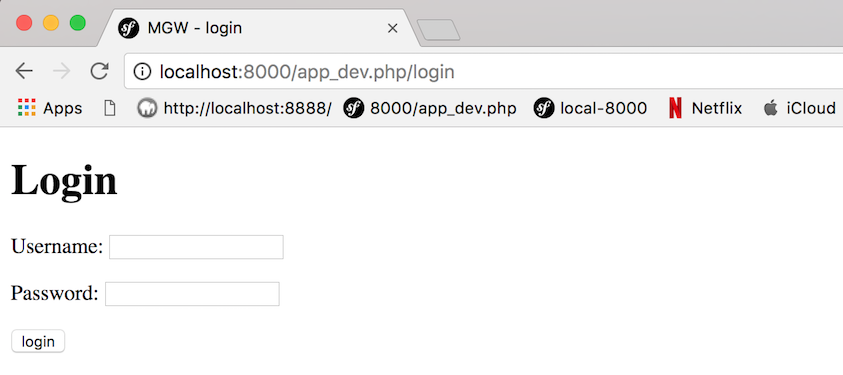
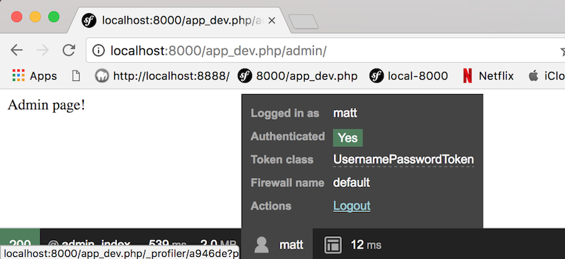

# Custom login page and a logout route


## Custom login form controller (`project18`)

The Symfony documentation tell's us how to create a custom login form, with CSRF protection, so let's do that.

- [How to build a Traditional Login form](http://symfony.com/doc/current/security/form_login_setup.html)

- [CSRF protection in the Login form](http://symfony.com/doc/current/security/csrf_in_login_form.html) (NOTE the default settings work fines for this - we just need to make sure any Twig templates we write display the appropriate hidden CSRF form fields...)

First we need to replace out `http_basic` login authentication with our own, custom login form. We do this by replacing `http_basic: ~` in our `main` firewall with the a `form_login` entry.

**NOTE** Below I have commented-out the `http_basic` entry, to make it clear where we are replacing its entry:

```yaml
security:
    encoders:
        Symfony\Component\Security\Core\User\User: plaintext

    providers:
        in_memory:
            memory:
                users:
                    user:
                        password: user
                        roles: 'ROLE_USER'
                    admin:
                        password: admin
                        roles: 'ROLE_ADMIN'
                    matt:
                        password: smith
                        roles: 'ROLE_ADMIN'

    firewalls:
        dev:
            pattern: ^/(_(profiler|wdt)|css|images|js)/
            security: false

        main:
            anonymous: ~
#            http_basic: ~
            form_login:
                login_path: login
                check_path: login
```

The above declares that the route for an authentication login form is named `login` (we'll add a controller naming that route next). We are defining 2 important properties for the security system^[Note - we could also specifric CSRF token settings here, but the Symfony security defaults all work fine [Symfony default security settings](http://symfony.com/doc/current/reference/configuration/security.html)]:

- `login_path` - this is the route users will be redirected to if they attempt to access a resource but are do not have the authentication permitted to do so

- `check_path` - this is the route which the login form will submit a POST request to

You can read more about these paths, and other customisable features of the Symfony login system in the Symfony documentation:

- [Symfony login and `check_path` reference](http://symfony.com/doc/current/reference/configuration/security.html#check-path)

Let's create a new `SecurityController` in `src/AppBundle/Controller/` which declares the login route, and also tells our application to render a Twig custom login form template.

**NOTE** We have broken-down the final steps of naming the Twig template and building the Twig argument array (simplying the one-liner code from the Symfony documentation):

```php
    public function loginAction(Request $request)
    {
        $authenticationUtils = $this->get('security.authentication_utils');

        // get the login error if there is one
        $error = $authenticationUtils->getLastAuthenticationError();

        // last username entered by the user
        $lastUsername = $authenticationUtils->getLastUsername();

        // Twig stuff
        $templateName = 'security/login';
        $argsArray = [
            'last_username' => $lastUsername,
            'error'         => $error,
        ];

        return $this->render($templateName . '.html.twig', $argsArray);
    }
```

Looking at the above we can note the following:

- the first statement get a reference to the Symfony security utilities service `$authenticationUtils`
- the next 2 statements get any stored error `$error`, and the previous username `$last_username` (for repeated login attempts)
- finally we have our Twig statements, declaring that the login template is in views directory `security`, and building and then passing to Twig an arguments array containing the error and last username

We also can see that there is no logic in this method to **process** the submission of the form. The Symfony security system will process login form submission by looking through all its **providers** to see if it can match with a username/password pair, and acting accordingly.

## Creating the login form Twig template

Let's write our Twig template for the login form (copied from the Symfony documentation pages). A heading 1 and some paragraph tags have been added, also the special form hidden element for CSRF protection.


Figure \ref{login_form} shows the login form we'll create.



Here is `app/Resources/views/security/login.html.twig`:

```html
    

     login page 

    
        <h1>Login</h1>

        
            <div>{{ error.messageKey|trans(error.messageData, 'security') }}</div>
        

        <form action="{{ path('login') }}" method="post">

            <input type="hidden" name="_csrf_token"
                   value="{{ csrf_token('authenticate') }}"
            >

            <p>
            <label for="username">Username:</label>
            <input type="text" id="username" name="_username" value="{{ last_username }}" />

            <p>
            <label for="password">Password:</label>
            <input type="password" id="password" name="_password" />

            <p>
            <button type="submit">login</button>
        </form>

    

```

Above we can see the following in our Login Twig template:

- a level 1 heading
- display of any Twig `error` variable received
- the HTML `<form>` open tag, which we see submits via HTTP `POST` method to the route named `login`
- a hidden form field with the `_csrf_token` to protect against forged request attacks one (CSRF tokens help protect web applications against cross-site scripting request forgery attacks and forged login attacks ^[More about forged login attacks on [Wikipedia](https://en.wikipedia.org/wiki/Cross-site_request_forgery#Forging_login_requests)]).

- the `username` label and text input field (and value of the `last_username` if any)
- the `password` label and password input field
- the submit button named `login`


## Adding a `/logout` route

We can define a route to logout very easily in Symfony, with no need for any controller method. In `app/config/routing.yml` we add our login route, and its redirect to the website home page `/`. We add our 2 lines to the end of this existing configuration file, since the default contents of this file tell Symfony to look for route annotation comments in our controllers:

```yaml
    app:
        resource: '@AppBundle/Controller/'
        type: annotation

    logout:
        path: /logout
```

We also need to define the logout route as part of our security firewall. So in `security.yml` we add the following to the default firewall:

```yaml
    logout:
        path:   /logout
        target: /

```

So our full  `security.yml` now looks as follows:

```yaml
    security:
        encoders:
            Symfony\Component\Security\Core\User\User: plaintext

        providers:
            in_memory:
                memory:
                    users:
                        user:
                            password: user
                            roles: 'ROLE_USER'
                        admin:
                            password: admin
                            roles: 'ROLE_ADMIN'
                        matt:
                            password: smith
                            roles: 'ROLE_ADMIN'


        firewalls:
            dev:
                pattern: ^/(_(profiler|wdt)|css|images|js)/
                security: false

            default:
                anonymous: ~
                form_login:
                    login_path: login
                    check_path: login

                logout:
                    path:   /logout
                    target: /
```

Figure \ref{logout_link} shows that we can see the logout route is available from the Symfony profile toolbar. We can, of course, also enter the route directly in the browser address bar, e.g. via URL:

```
    http://localhost:8000/app_dev.php/logout
```



In either case we'll logout any currently logged-in user, and return the anonymously authenticated user `anon` with no defined authentication roles.